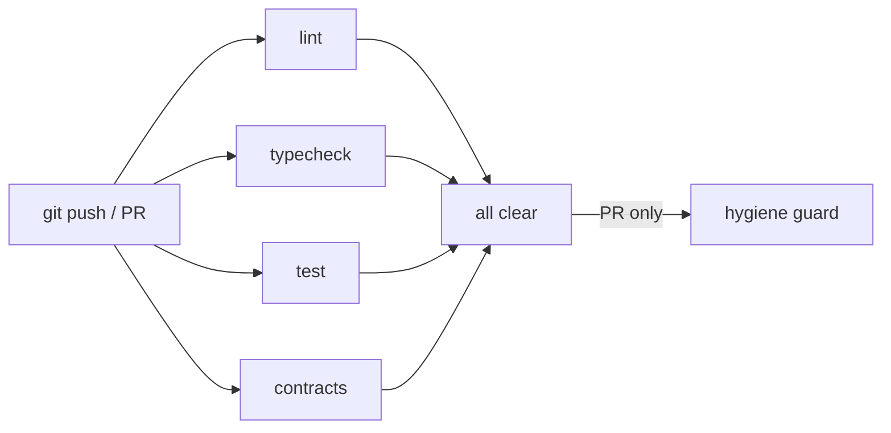

# Build Details — OperatorOne

**Branch** `dennis/automation-framework` &nbsp;·&nbsp; **Latest commit** `067a157` &nbsp;·&nbsp; **Date** 2026-03-07

---

## Table of Contents

0. [Judge Verification Checklist](#judge-verification-checklist)
1. [Repository Structure](#repository-structure)
2. [Monorepo & Toolchain](#monorepo--toolchain)
3. [Applications](#applications)
4. [Shared Packages](#shared-packages)
5. [Agent Architecture](#agent-architecture)
6. [Handoff Contracts](#handoff-contracts)
7. [Dashboard & Venture Studio](#dashboard--venture-studio)
8. [Z.AI / GLM-5 Integration](#zai--glm-5-integration)
9. [Tests & Quality Gates](#tests--quality-gates)
10. [CI Pipeline](#ci-pipeline)
11. [Deployed Products](#deployed-products)
11a. [What Makes This Different](#what-makes-this-different)
12. [Hackathon Bounties](#hackathon-bounties)
13. [Commit History](#commit-history)

---

## Judge Verification Checklist

Use this checklist to verify all claims in under five minutes.

| Step | Command | Expected result |
|---|---|---|
| 1. Clone and checkout | `git clone https://github.com/Daihaolin201/OperatorOne && cd OperatorOne && git checkout dennis/automation-framework` | Branch checked out cleanly |
| 2. Run CEO orchestrator | `python3 workspaces/op1_ceo/scripts/run_ceo_multi_agent_orchestrator_v1.py --dry-run` | 4-agent loop completes, artifacts written |
| 3. Read venture state | `cat workspaces/op1_ceo/research/ceo_orchestration/venture_state.latest.json` | MRR $49, stage OPERATIONS, 6 deployed URLs |
| 4. Run preflight tests | `python3 -m pytest dashboard/tests/ -q` | 5 passed, GLM-5 confirmed |
| 5. Validate contracts | `python3 scripts/validate_handoffs.py --repo-root .` | 9 contracts valid |
| 6. Start dashboard | `python3 dashboard/server.py --host 127.0.0.1 --port 8765` | Dashboard at http://127.0.0.1:8765 |
| 7. View live products | Open any URL from the Deployed Products table | Landing page loads |

**Key artifacts to inspect:**
- `workspaces/op1_ceo/research/ceo_orchestration/venture_state.latest.json` — KPI proof
- `workspaces/op1_ceo/research/ceo_orchestration/approval.json` — approval gate state
- `handoffs/*.json` — 9 typed inter-agent contracts
- `dashboard/zai_preflight.py` — Z.AI compliance gate
- `workspaces/op1_ceo/AGENTS.md` — CEO persona definition

---

## Repository Structure

```
OperatorOne/
├── apps/
│   ├── portal/              # @op1/portal  — Venture dashboard (Next.js 15, port 3000)
│   └── product/             # @op1/product — Product landing pages (Next.js 15, port 3001)
├── packages/
│   ├── ui/                  # @op1/ui            — Shared React components
│   ├── types/               # @op1/types          — Shared TypeScript types
│   ├── i18n/                # @op1/i18n           — EN / ZH translation strings
│   ├── api-client/          # @op1/api-client     — API client utilities
│   ├── config/              # @op1/config         — ESLint / Tailwind / TS base configs
│   └── vitest-config/       # @op1/vitest-config  — Shared Vitest configuration
├── workspaces/
│   ├── op1_ceo/             # CEO orchestrator scripts + KPI state artifacts
│   ├── op1_product/         # Product agent workspace + research artifacts
│   ├── op1_marketing/       # Marketing agent workspace + stage pipelines
│   ├── op1_sales/           # Sales agent workspace + outreach pipeline
│   ├── op1_operations/      # Operations agent workspace + feedback loop
│   └── op1_manager/         # Cross-agent audit (not registered in manifest)
├── handoffs/                # 9 typed JSON inter-agent contracts
├── dashboard/               # Python venture studio & monitor server (port 8765)
├── openclaw/                # agents.manifest.json + profile config
├── official-site/           # Static intro site (Vercel)
├── shared/                  # Shared skills, prompts, templates
├── scripts/                 # Handoff validation, upgrade, hygiene utilities
├── docs/                    # Architecture, runbook, studio spec, audit reports
└── .github/workflows/       # CI workflow definitions
```

---

## Monorepo & Toolchain

| Item | Value |
|---|---|
| Package manager | pnpm 10.30.3 |
| Build system | Turborepo 2.4.4 |
| Node.js | >= 20.0.0 |
| TypeScript | 5.8.2 |
| Prettier | 3.5.3 |

### Turbo pipeline (`turbo.json`)

| Task | Depends on | Outputs | Cache |
|---|---|---|---|
| `build` | `^build` | `.next/**`, `dist/**` | yes |
| `dev` | — | — | no (persistent) |
| `lint` | `^lint` | — | yes |
| `typecheck` | `^typecheck` | — | yes |
| `test` | `^build` | `coverage/**`, `coverage.json` | yes |
| `clean` | — | — | no |

### Root scripts

```bash
pnpm build          # turbo run build (all packages, dependency order)
pnpm dev            # all apps in parallel
pnpm dev:portal     # @op1/portal only (port 3000)
pnpm dev:product    # @op1/product only (port 3001)
pnpm lint           # turbo run lint
pnpm typecheck      # turbo run typecheck
pnpm test           # turbo run test
pnpm clean          # clean all .next / dist + node_modules
pnpm format         # prettier --write **/*.{ts,tsx,md,json}
```

---

## Applications

### `@op1/portal` — Venture Dashboard

| Attribute | Value |
|---|---|
| Framework | Next.js 15.2.2 (App Router) |
| Dev port | 3000 |
| i18n | next-intl 4.1.0 (EN / ZH) |
| Styling | Tailwind CSS 4 |
| Build output | `.next/` |

**Routes**

```
/[locale]/dashboard    Agent status, KPI monitor, handoff chain
/[locale]/ventures     Venture studio — stage execution and artifact view
/[locale]/agents       Agent registry view
```

---

### `@op1/product` — Product Landing Pages

| Attribute | Value |
|---|---|
| Framework | Next.js 15.2.2 (App Router) |
| Dev port | 3001 |
| i18n | next-intl 4.1.0 (EN / ZH) |
| Styling | Tailwind CSS 4 |
| Build output | `.next/` |

**Routes**

```
/[locale]/             Landing page
/[locale]/about        About
/[locale]/pricing      Pricing
```

---

## Shared Packages

| Package | Version | Description |
|---|---|---|
| `@op1/ui` | 0.0.0 | Shared React 19 components; ESM + CJS exports |
| `@op1/types` | 0.0.0 | Shared TypeScript type definitions |
| `@op1/i18n` | 1.0.0 | EN/ZH translation strings |
| `@op1/api-client` | 1.0.0 | API client with separate `./types` export path |
| `@op1/config` | — | ESLint, Tailwind, TypeScript base configurations |
| `@op1/vitest-config` | 0.0.0 | Vitest base + UI configs; Vitest + React Testing Library |

All packages use workspace-local references (`workspace:*`) and export via `./src/index.ts`.

---

## Agent Architecture

### CEO Orchestrator

```
Script   workspaces/op1_ceo/scripts/run_ceo_multi_agent_orchestrator_v1.py
Model    GLM-5  (Z.AI, 744B MoE, 40B active, MIT license)
Loop     Product -> Marketing -> Sales -> Operations -> (iterate)
Gate     workspaces/op1_ceo/research/ceo_orchestration/approval.json
```

**Output artifacts**

| File | Contents |
|---|---|
| `run.latest.json` | Full 4-agent execution log with simulation replies |
| `venture_state.latest.json` | KPI snapshot (MRR, prospects, deployed URLs, gates) |
| `orchestrator_summary.latest.json` | Operator-facing summary |

**Quick start**

```bash
git clone https://github.com/Daihaolin201/OperatorOne
cd OperatorOne
git checkout dennis/automation-framework
python3 workspaces/op1_ceo/scripts/run_ceo_multi_agent_orchestrator_v1.py --dry-run
cat workspaces/op1_ceo/research/ceo_orchestration/venture_state.latest.json
```

---

### Agent Roster (`openclaw/agents.manifest.json`, version 1.1.0)

| ID | Role | Workspace | Owner | In manifest |
|---|---|---|---|---|
| `op1_product` | Product | `workspaces/op1_product` | Bennett | yes |
| `op1_marketing` | Marketing | `workspaces/op1_marketing` | Dennis | yes |
| `op1_sales` | Sales | `workspaces/op1_sales` | Dennis | yes |
| `op1_operations` | Operations | `workspaces/op1_operations` | Bennett | yes |
| `op1_manager` | Manager | `workspaces/op1_manager` | — | no |

**OpenClaw profile config**

```
profile              operatorone
profileDefaultModel  openai-codex/gpt-5.3-codex
gatewayPort          30740
skillsExtraDirs      shared/skills
```

---

### Current Venture KPIs (`venture_state.latest.json`, 2026-03-07)

| Metric | Value |
|---|---|
| Venture ID | `venture_20260307_222405` |
| Goal | Reach first $100 MRR |
| Current MRR | **$49** |
| Stage | OPERATIONS (completed) |
| Prospects contacted | 13 |
| Replies received | 6 |
| Customers converted | 1 |
| Deployed products | 6 live Vercel URLs |
| `go_to_marketing` gate | true |
| `go_to_sales` gate | true |
| `go_to_operations` gate | true |
| Budget constraint | $200 cash spend max |
| Time constraint | 14 days |

---

## Handoff Contracts

9 typed JSON contracts, all at `contract_version: 1.0.0`.

```
handoffs/
├── product_to_marketing.json              Product -> Marketing
├── marketing_to_sales.json                Marketing -> Sales
├── sales_to_operations.json               Sales -> Operations
├── operations_to_product.json             Operations -> Product (feedback)
├── operations_to_marketing.json           Operations -> Marketing (feedback)
├── operations_to_sales.json               Operations -> Sales (feedback)
├── operations_to_product_iterate.json     Operations -> Product (iterate)
├── operations_to_marketing_iterate.json   Operations -> Marketing (iterate)
└── operations_to_sales_iterate.json       Operations -> Sales (iterate)
```

Each contract includes `contract_version`, `generated_at`, and `generated_by` metadata fields for full traceability.

**Validation**

```bash
python3 scripts/validate_handoffs.py --repo-root .
python3 scripts/upgrade_handoffs.py --repo-root .    # backfill missing metadata
```

---

## Dashboard & Venture Studio

```bash
python3 dashboard/server.py --host 127.0.0.1 --port 8765
# open http://127.0.0.1:8765
```

### API Surface

| Endpoint | Method | Description |
|---|---|---|
| `/api/studio/fast-snapshot` | GET | Lightweight studio state (recommended) |
| `/api/studio/snapshot` | GET | Full snapshot; optional `?includeMonitor=1` |
| `/api/studio/artifact` | GET | Read artifact by repo-relative path |
| `/api/studio/action` | POST | Trigger a stage action |
| `/api/studio/jobs` | GET | List running jobs |
| `/api/studio/jobs/<id>` | GET | Single job status |
| `/api/monitor/cached-snapshot` | GET | Monitor-only cached state |
| `/api/snapshot` | GET | Compatibility alias (cache-backed) |
| `/api/runtime-flags/manual-arm` | POST | Arm live-mode for high-risk actions |
| `/api/integrations/channel/connect` | POST | Connect integration channel |
| `/api/integrations/channel/disconnect` | POST | Disconnect integration channel |
| `/api/integrations/secrets/audit` | POST | Audit configured secrets |
| `/api/integrations/secrets/reload` | POST | Reload secrets |

### Runtime State Files (`dashboard/.runtime/studio/`)

| File | Contents |
|---|---|
| `state.json` | Venture states |
| `ventures.json` | Venture registry |
| `stage_runs.json` | Stage execution log |
| `decision_gates.json` | Decision gate records |
| `loop_todos.json` | Ops feedback items fed back to agents |
| `deployments.json` | Vercel deployment registry |
| `contexts/<venture>.json` | Per-venture context snapshot |

### Safety Boundaries

- Accessible on localhost only (`127.0.0.1`) by default
- High-risk actions (email send, Vercel deploy) require manual arm + explicit confirmation
- No arbitrary shell execution; all actions are whitelisted
- Live mode disabled by default; opt-in per action with `confirmLive=true`

---

## Z.AI / GLM-5 Integration

### Environment Configuration

```bash
export ZAI_API_BASE="https://api.z.ai/api/paas/v4"
export ZAI_MODEL="glm-5"
export ZAI_API_KEY="<your-key>"
```

### Preflight Gate (`dashboard/zai_preflight.py`)

The system enforces a mandatory pre-flight check before any Z.AI API interaction. Misconfiguration raises `ZAIPreflightError` and halts — there is no silent fallback to another provider.

```python
ZAI_PROVIDER = "z.ai"
ZAI_MODEL    = "glm-5"

# Audit record shape
{
  "provider":    str,   # always "z.ai"
  "model":       str,   # always "glm-5"
  "step":        str,   # e.g. "env_check"
  "latency_ms":  int,
  "token_usage": None,  # None at preflight (no real API call)
  "request_id":  str    # UUID4 hex
}
```

### GLM-5 Model Specifications

| Attribute | Value |
|---|---|
| Released | February 2026 (Z.AI / Zhipu AI) |
| Codename | Pony Alpha |
| Architecture | 744B total params, 40B active (MoE) |
| Training tokens | 28.5T |
| Context window | 202K tokens |
| RL framework | "Slime" async RL (long-horizon agent behavior) |
| Attention | DeepSeek Sparse Attention (DSA) |
| License | MIT (open weights) |
| Input pricing | $0.80 / M tokens |
| Output pricing | $2.56 / M tokens |

### Benchmark Results

| Benchmark | Score | Notes |
|---|---|---|
| SWE-bench Verified | **77.8%** | Open weights #1 — agentic coding |
| Terminal-Bench-2.0 | **61.1%** | +28.3% vs GLM-4.7 |
| BrowseComp | **75.9%** | +8.4% vs GLM-4.7 |
| HLE with Tools | **50.4%** | +7.6% vs GLM-4.7 |
| AA Intelligence Index | **50** | Open weights leading |

### Per-Agent Model Routing

| Agent | Task type | Model | Reason |
|---|---|---|---|
| `op1_product` | Code gen, Vercel deploy | glm-5 | SWE-bench 77.8% — top open-weights coding model |
| `op1_marketing` | Content, SEO copy | glm-5 | 202K context, ultra-low hallucination rate |
| `op1_sales` | Outreach, dialogue | glm-5 | Native agent mode + Slime RL for planning |
| `op1_operations` | KPI analysis, JSON | glm-5 | Structured output, BrowseComp 75.9% |
| CEO Orchestrator | Planning, routing | glm-5 | Terminal-Bench +28.3% improvement |

---

## Tests & Quality Gates

### Python Test Suite

```bash
python3 -m pytest dashboard/tests/ -q
# 5 passed in 0.02s
```

| File | Tests | Coverage |
|---|---|---|
| `test_zai_preflight.py` | 3 | Preflight gate: valid key, missing key, empty key |
| `test_run_evidence_schema.py` | 2 | Run artifact index schema validation |

### Local Validation Scripts

```bash
python3 scripts/validate_handoffs.py --repo-root .     # validate all JSON contracts
python3 scripts/upgrade_handoffs.py --repo-root .      # backfill missing metadata fields
python3 scripts/change_hygiene_guard.py --staged       # pre-commit mixed-change guard
python3 scripts/reset_generated_artifacts.py --apply   # reset pipeline output artifacts
bash scripts/ci-local.sh                               # local equivalent of CI jobs
```

---

## CI Pipeline

**Workflows** (`.github/workflows/`)

| Workflow | Trigger | Jobs |
|---|---|---|
| `ci.yml` | push / PR → `main` | lint, typecheck, test, contracts, hygiene |
| `handoff-contract-validation.yml` | push / PR | validate handoff JSON contracts |
| `change-hygiene.yml` | PR | mixed-change guard (`--allow-mixed` on PR) |

### CI Jobs (`ci.yml`)

| Job | Runner | Timeout | Notes |
|---|---|---|---|
| `lint` | ubuntu-latest | 10 min | `pnpm turbo run lint --affected` |
| `typecheck` | ubuntu-latest | 10 min | `pnpm turbo run typecheck --affected` |
| `test` | ubuntu-latest | 15 min | `pnpm turbo run test --affected` |
| `contracts` | ubuntu-latest | 5 min | `python3 scripts/validate_handoffs.py` — active now |
| `hygiene` | ubuntu-latest | 5 min | PR only; `change_hygiene_guard.py --allow-mixed` |

All Node.js jobs use Node 22, pnpm 10, frozen lockfile install.

### Pipeline Flow



---

## Deployed Products

| URL | Product | Opportunity |
|---|---|---|
| https://webproductmodularinvoice.vercel.app | Invoice follow-up tool | opp_001 |
| https://webproductmodularchargeback.vercel.app | Chargeback response ops | opp_001 |
| https://webproductmodularreporting.vercel.app | Client reporting module | opp_001 |
| https://webproductlandingstage3validation.vercel.app | Validation landing page | validation |
| https://webproductlandingstage3opp002.vercel.app | opp_002 landing page | opp_002 |
| https://webproductlandingstage3opp003.vercel.app | opp_003 landing page | opp_003 |
| https://official-site-theta.vercel.app | Official intro site | — |

---

## What Makes This Different

Most hackathon submissions demonstrate agent capability. OperatorOne demonstrates agent output.

| Dimension | Typical submission | OperatorOne |
|---|---|---|
| Scope | Single agent or demo | 4-agent CEO orchestrator with feedback loop |
| Evidence | Screenshot or mock data | $49 live MRR, 1 paying customer, 6 deployed URLs |
| State management | In-memory or none | 9 typed JSON contracts with version metadata |
| Human oversight | None or ad hoc | Approval gate controls all external actions |
| Model compliance | OpenAI fallback | GLM-5 exclusive, hard preflight gate, audit fields |
| Iteration | One shot | Operations feedback re-enters Product + Marketing |
| Reproducibility | Run once | `--dry-run` mode, validated contracts, reset scripts |

The system was built under a $200 cash budget over 14 days. Every number in this document is sourced directly from `venture_state.latest.json`.

---

## Hackathon Bounties

| Bounty | Evidence | Verify |
|---|---|---|
| **CEOClaw Challenge** (£1,000) — AI founder, idea to $100 MRR | `venture_state.latest.json` — $49 MRR, 6 deploys, 13 prospects | `python3 workspaces/op1_ceo/scripts/run_ceo_multi_agent_orchestrator_v1.py --dry-run` |
| **Z.AI Gold Bounty** — GLM as core component, correct base URL, audit fields | `dashboard/zai_preflight.py` — all 5 roles use glm-5, no fallback | `python3 -m pytest dashboard/tests/ -q` |
| **Animoca Brands** — identity, memory, cognition | `workspaces/op1_ceo/AGENTS.md` + 9 JSON contracts with persistent state | inspect `handoffs/*.json` |
| **Human for Claw** — dashboard + approval gate | `dashboard/` on port 8765 + `approval.json` gate | `python3 dashboard/server.py` |

---

## Commit History

| Hash | Message |
|---|---|
| `1cf9560` | fix(test): update expected model in preflight test to glm-5 |
| `d3ccb32` | fix: repair SVG escape sequences and upgrade preflight model to glm-5 |
| `5ca7a97` | docs: add SVG diagrams, upgrade to GLM-5, polish bilingual README |
| `e2efbc7` | 优化 |
| `3d0ac39` | docs: enhance README with Mermaid diagrams, Z.AI bounty section, and bounty coverage map |
| `e04d719` | chore(evidence): define run artifact index schema |
| `7061ea8` | fix(op1-product): align deploy url reader/writer compatibility |
| `a47920f` | feat(zai): add glm preflight contract and audit fields |
| `7a7de8b` | docs: rewrite README with bilingual EN/ZH support, default English |
| `ab33423` | feat(ceo): add hackathon demo script, dorahacks submission, fix orchestrator simulation |
| `ead1e95` | feat(ceo): polish orchestrator simulation, add hackathon README and demo script |
| `e066f49` | feat(ui): add one-click startup, platform/product workspace modes, and zh-en switch |
| `2d62375` | feat(dashboard): add opencode-style CEO flow visualization tab |
| `bb54170` | feat(ceo): add multi-agent orchestrator mode and dashboard trigger |
| `8ced819` | feat(studio): add CEO autopilot action and register op1_ceo workspace |
| `c8d18b7` | feat(op1_product): add CEO state machine, approval gate, and stage2 fallback retries |
| `e45e981` | feat(op1_product): add CEO autopilot v1 orchestration contract and runner |
| `7f7fd49` | feat: remove demo form and document official project intro page |
| `0cdc711` | feat: revamp official site with i18n and conversion UX upgrades |
| `9799162` | feat: add animated official OperatorOne landing page |
| `210874a` | chore: sync full project snapshot for Bennett branch |
| `475e709` | fix(marketing): scope Stage2/Stage3 generation to active opportunity |
| `6eb0a70` | fix(studio-ui): restore demo reset button in global status panel |
| `56452cb` | chore(studio-ui): remove low-value judge panels for cleaner workflow |
| `1a1b5c4` | studio: unblock stage transition flow and simplify judge UI |
| `67a340f` | feat(studio): add copilot-led UX with explicit stage transition confirmations |
| `118560c` | feat(studio): add user prompt window with stage-aware Q&A guidance |
| `5f75a15` | fix(ci): make change-hygiene strict on PR and informational on push |
| `aaea898` | chore(snapshot): preserve reproducibility artifacts before hygiene cleanup |
| `520bf26` | chore(hygiene): enforce mixed-change guard and generated artifact workflow |
| `5a6ea88` | chore(ci): enforce handoff contract validation in workflow |
| `527b1f0` | feat(contracts): add handoff versioning and strict validation flow |
| `5559e41` | docs(integration): harden OperatorOne architecture and workflow docs |
| `9b5b84d` | feat(studio): add capability proof wall and deeper landing-page sync |
| `d51c876` | feat(studio): improve artifact readability and cross-stage product sync UX |
| `d35561c` | feat(studio): add judge quick controls and clearer marketing workflow UX |
| `39a709a` | fix(studio): unblock precheck, repair preview routing, restore artifact links |
| `c494c58` | feat(studio): stabilize gate metrics and add demo-history reset workflow |
| `efdf829` | feat(integration): upgrade studio demo UX, vercel governance, preflight loop |
| `1b36ae8` | feat(studio): complete p0-p4 demo polish, artifact visibility, and robustness |
| `1f94573` | perf(studio): split fast snapshot/cache and add guided UX |
| `aa916dc` | feat(studio): implement venture studio workflow across phase 0-4 |
| `794861d` | feat(dashboard): add OperatorOne multi-agent control dashboard |
| `430eb3a` | chore(op1_manager): track manager workspace templates for team use |
| `e5d3452` | audit: rerun multi-agent capability pipelines for strict verification |
| `decfdfd` | feat(operations): implement stage1-3 ops capabilities and package skills |
| `c4ac562` | op1_sales: finalize Stage1-3 capabilities and package reproducible skills |
| `97057ff` | feat(marketing): implement Stage3 launch-campaign orchestration and skill |
| `90ce277` | feat(marketing): add Stage2 publish-content workflow and review ops |
| `cf0c135` | migrate Stage1 SEO experiment capability to op1_marketing |
| `77e3bf9` | implement continuous Stage1 SEO capability with full product ingest |
| `3c144f2` | fix Stage3 skill discovery and tighten MVP scope skill contract |
| `30c38a2` | feat(product): complete stage3 landing capability and add dedicated skill |
| `30c38a2` | fix(product): align stage2 skills with scoring outputs and gates |
| `7c236a7` | op1_product: complete modular build/deploy v1.1 iteration A-D |
| `0b1ba73` | feat(op1_product): add reusable startup-idea framework and pipeline |
| `323186a` | feat: scaffold OperatorOne multi-agent framework and safe OpenClaw sync |
| `f7408c1` | Initial commit |

---

*Generated from live project state on 2026-03-07. Source of truth: `git log`, `package.json`, `turbo.json`, `openclaw/agents.manifest.json`, `workspaces/op1_ceo/research/ceo_orchestration/venture_state.latest.json`.*
