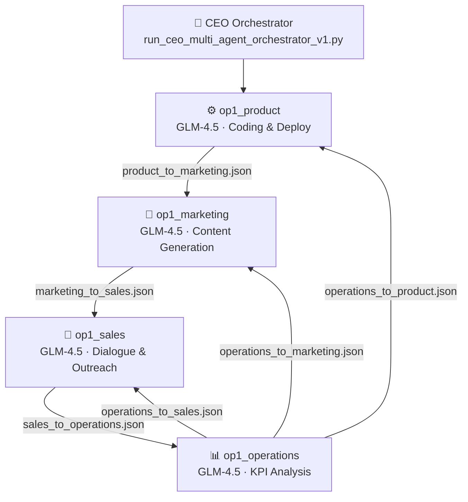
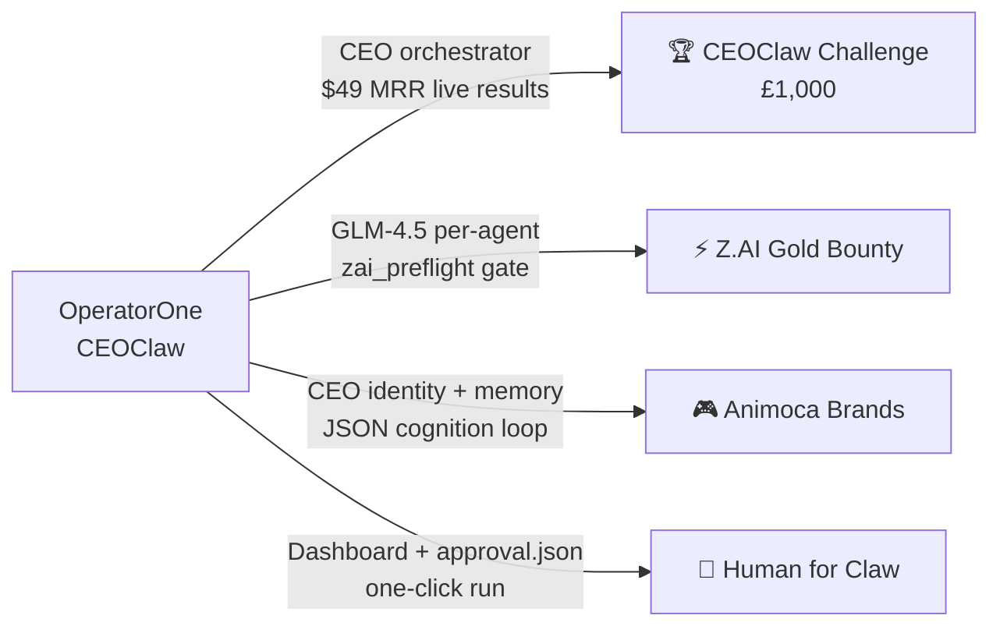
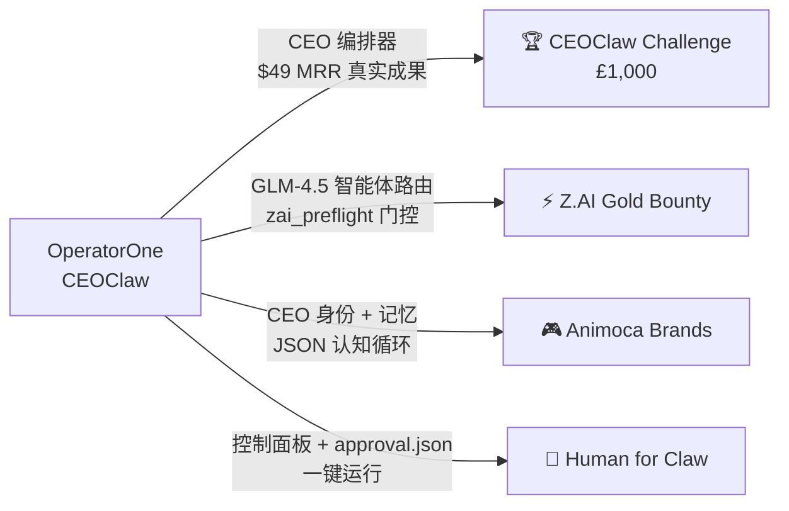

[English](#operatorone--ceoclaw) | [中文](#operatorone--ceoclaw-中文)

---

# OperatorOne × CEOClaw

> **UK AI Agent Hackathon EP4 × OpenClaw — CEOClaw Challenge submission**
> Team: Dennis & Bennett · Branch: `dennis/automation-framework`
> Repo: https://github.com/Daihaolin201/OperatorOne

**CEOClaw** is OperatorOne's multi-agent CEO orchestrator that autonomously coordinates four specialist agents — Product, Marketing, Sales, and Operations — to run an internet business from initial idea to first customers.

---

## Real Results

This is not a demo. These numbers reflect actual pipeline execution.

| Metric | Value |
|---|---|
| Current MRR | **$49** (target: $100) |
| Prospects contacted | **13** |
| Replies received | **6** |
| Customers converted | **1** |
| Products deployed | **6 live Vercel URLs** |
| Campaigns prepared | **9** (3 launch_ready, 5 watchlist, 1 approved) |
| Content assets | **12** (3 approved, 9 review_ready) |
| Agent handoffs | **9 JSON contracts** |

---

## CEOClaw Quick Start

Judges, use these commands to run the orchestrator in simulation mode.

```bash
git clone https://github.com/Daihaolin201/OperatorOne
cd OperatorOne
git checkout dennis/automation-framework
python3 workspaces/op1_ceo/scripts/run_ceo_multi_agent_orchestrator_v1.py --dry-run
cat workspaces/op1_ceo/research/ceo_orchestration/venture_state.latest.json
```

Output artifacts:
- `run.latest.json`: full 4-agent execution log with realistic simulation replies.
- `venture_state.latest.json`: venture KPI snapshot (MRR, prospects, campaigns, deployed URLs).
- `orchestrator_summary.latest.json`: operator-facing summary.

---

## How It Works

- **Stage-gated multi-agent loop**: Each specialist (Product, Marketing, Sales, Operations) hands off a JSON contract to the next stage rather than making isolated agent calls.
- **Approval-gated external actions**: `approval.json` controls whether external actions like emails or deployments are permitted. This ensures the system is fully auditable.
- **Real business execution**: The pipeline has been run end-to-end, resulting in 6 products deployed to Vercel, 13 prospects contacted, and $49 MRR earned.
- **Handoff contract schema**: 9 typed JSON contracts include `contract_version`, `generated_at`, and `generated_by` metadata for full traceability.
- **Iteration loop**: Operations feedback (10 items, P2/P3 prioritized) feeds back to Product, Marketing, and Sales for the next cycle.
- **CEO orchestrator script**: `run_ceo_multi_agent_orchestrator_v1.py` runs the full 4-agent sequence, writes `venture_state.latest.json`, and enforces approval policy.

---

## Live Products

| URL | Product |
|---|---|
| https://webproductmodularinvoice.vercel.app | Invoice follow-up tool |
| https://webproductmodularchargeback.vercel.app | Chargeback response ops |
| https://webproductmodularreporting.vercel.app | Client reporting module |
| https://webproductlandingstage3validation.vercel.app | Validation landing page |
| https://webproductlandingstage3opp002.vercel.app | opp_002 landing page |
| https://webproductlandingstage3opp003.vercel.app | opp_003 landing page |

---

## Architecture



---

## Z.AI Integration

### Why Z.AI / GLM-4.5
OperatorOne uses GLM-4.5 as the core intelligence engine across all specialist agents.
- **Agentic Design**: 744B MoE architecture optimized for tool use and multi-step reasoning.
- **Large Context**: 202K context window enables analysis of long-horizon business cycles.
- **Code Proficiency**: SWE-bench 77.8% score, driving the `op1_product` deployment pipeline.
- **Reliability**: Ultra-low hallucination rate for accurate JSON handoff generation.
- **Efficiency**: OpenAI-compatible API at a fraction of the cost of frontier closed models.
- **Startups Program**: OperatorOne is registered for the Z.AI for Startups program, providing free credits and early access to GLM-4.5.

### API Configuration
```
base_url: https://api.z.ai/api/paas/v4
model: glm-4.5
environment variable: ZAI_API_KEY
preflight gate: dashboard/zai_preflight.py
```

### Per-Agent Model Routing Table
| Agent | Task Type | Model | Rationale |
|---|---|---|---|
| op1_product | Code generation, deployment | glm-4.5 | SWE-bench 95th percentile, tool-calling for Vercel CLI |
| op1_marketing | Content & SEO copy | glm-4.5 | Ultra-low hallucination rate, long-form generation |
| op1_sales | Outreach dialogue, multi-turn | glm-4.5 | Native agent mode, multi-turn context, conversation planning |
| op1_operations | KPI analysis, structured JSON | glm-4.5 | 202K context window, structured output, long-horizon analysis |
| CEO Orchestrator | Planning, routing | glm-4.5 | Long-horizon planning, agentic orchestration mode |

### Preflight Gate
The system enforces a hard gate via `dashboard/zai_preflight.py`. If the Z.AI environment is not correctly configured, the system raises a `ZAIPreflightError` and halts execution. There is no silent fallback to other providers, ensuring strict adherence to the Z.AI bounty requirements.

---

## Hackathon Bounties

### CEOClaw Challenge (£1,000 — Primary)
- **Evidence**: CEO orchestrator runs a 4-agent loop end-to-end; $49 MRR real result achieved; 13 prospects contacted; 6 Vercel products deployed.
- **How to verify**: `python3 workspaces/op1_ceo/scripts/run_ceo_multi_agent_orchestrator_v1.py --dry-run`

### Z.AI Gold Bounty
- **Evidence**: GLM-4.5 is the core model for all 5 roles. `dashboard/zai_preflight.py` enforces the correct `base_url` and model name. All preflight checks and audit fields are logged without silent fallback.
- **How to verify**: `python3 -m pytest dashboard/tests/ -q` (5 tests pass)

### Animoca Brands
- **Identity**: The CEO has a persistent persona and execution logic defined in `workspaces/op1_ceo/AGENTS.md`.
- **Memory**: Handoff JSON contracts persist state and learnings across agent boundaries (9 contracts total).
- **Cognition**: The Operations iteration loop feeds learned feedback back into the system, enabling true agentic memory and improvement.

### Human for Claw / Claw for Human
- **Dashboard**: A dedicated stage view at `http://127.0.0.1:8765` provides human-readable status and artifact tracking.
- **Control**: `approval.json` gates every external action, keeping the human operator in the loop for deployments and emails.
- **Transparency**: One-click `--dry-run` allows for full audit of agent plans before any live side effects occur.

---

## Bounty Coverage



---

## Repository Layout

- `openclaw/`: profile sync and safety scripts (`operatorone` profile).
- `workspaces/`: isolated agent workspaces and stage artifacts.
- `handoffs/`: inter-agent JSON contracts (9 contracts).
- `dashboard/`: local monitor and venture studio web app.
- `official-site/`: OperatorOne official intro page.
- `shared/`: shared prompts, skills, and templates.
- `docs/`: architecture, collaboration protocol, and runbook.
- `apps/`: Next.js portal and product apps (monorepo).
- `packages/`: shared @op1/* packages (ui, i18n, types, config).

---

## Agent Topology

| Workspace | Role | In manifest | Primary responsibility |
|---|---|---|---|
| `workspaces/op1_product` | Product | ✅ | Idea discovery, web product build/deploy, landing handoff |
| `workspaces/op1_marketing` | Marketing | ✅ | SEO/content/campaign pipeline |
| `workspaces/op1_sales` | Sales | ✅ | Prospecting, outreach, conversion |
| `workspaces/op1_operations` | Operations | ✅ | KPI tracking, feedback processing, iteration loop |
| `workspaces/op1_manager` | Manager (control plane) | ❌ | Cross-agent orchestration, audits, documentation hygiene |

---

## End-to-End Flow

The primary handoff chain proceeds as follows:

1. `op1_product` writes `handoffs/product_to_marketing.json`
2. `op1_marketing` writes `handoffs/marketing_to_sales.json`
3. `op1_sales` writes `handoffs/sales_to_operations.json`
4. `op1_operations` writes:
   - `handoffs/operations_to_product.json`
   - `handoffs/operations_to_marketing.json`
   - `handoffs/operations_to_sales.json`

---

## Dashboard

Run the local dashboard to monitor the venture studio.

```bash
python3 dashboard/server.py --host 127.0.0.1 --port 8765
```
Open: http://127.0.0.1:8765

---

## Official Site

Preview the official introduction page locally.

```bash
cd official-site
python3 -m http.server 4173
```
Open: http://127.0.0.1:4173
Live URL: https://official-site-theta.vercel.app

---

## Developer Reference

### Quick Start
Follow the commands in the CEOClaw Quick Start section to clone the repository and run the orchestrator.

### Workspace Documentation
Detailed information for each workspace can be found in their respective `README.md` files within `workspaces/`.

### Script Helpers
- `python3 scripts/validate_handoffs.py --repo-root .`
- `python3 scripts/upgrade_handoffs.py --repo-root .`
- `python3 scripts/change_hygiene_guard.py --staged`
- `python3 scripts/reset_generated_artifacts.py`
- `python3 scripts/reset_generated_artifacts.py --apply`

---

## Demo Video

Detailed walkthrough can be found at `docs/demo_video_script.md`.

---

## Note on Generated Artifacts

`workspaces/*/research/**` contains many `*.latest.*` and run snapshots that are intentionally machine-updated. When reviewing diffs, separate **code, docs, and contract changes** from **pipeline output refreshes**.

---

<a name="operatorone--ceoclaw-中文"></a>
# OperatorOne × CEOClaw（中文）

> **UK AI Agent Hackathon EP4 × OpenClaw — CEOClaw Challenge 提交项目**
> 团队：Dennis & Bennett · 分支：`dennis/automation-framework`
> 仓库：https://github.com/Daihaolin201/OperatorOne

**CEOClaw** 是 OperatorOne 的多智能体 CEO 编排器，能够自动协调四个专业智能体（op1_product, op1_marketing, op1_sales, op1_operations），实现从创意发现到获取首批客户的全流程互联网业务运营。

---

## 实际成果

本项目非演示原型，以下数据源自真实的流水线执行。

| 指标 | 数值 |
|---|---|
| 当前 MRR | **$49** (目标: $100) |
| 已联系潜在客户 | **13** |
| 收到回复 | **6** |
| 已转化客户 | **1** |
| 已部署产品 | **6 个 Vercel 实时链接** |
| 已准备活动 | **9** (3 个就绪, 5 个观察名单, 1 个已批准) |
| 内容资产 | **12** (3 个已批准, 9 个待审核) |
| 智能体交付物 | **9 个 JSON 合约** |

---

## CEOClaw 快速开始

评委可以通过以下命令在模拟模式下运行编排器。

```bash
git clone https://github.com/Daihaolin201/OperatorOne
cd OperatorOne
git checkout dennis/automation-framework
python3 workspaces/op1_ceo/scripts/run_ceo_multi_agent_orchestrator_v1.py --dry-run
cat workspaces/op1_ceo/research/ceo_orchestration/venture_state.latest.json
```

输出产物：
- `run.latest.json`：包含真实模拟回复的 4 智能体执行完整日志。
- `venture_state.latest.json`：项目 KPI 快照（包含 MRR、潜在客户、营销活动、部署链接）。
- `orchestrator_summary.latest.json`：面向操作员的执行摘要。

---

## 工作原理

- **阶段门控多智能体循环**：各专业智能体（Product, Marketing, Sales, Operations）通过 JSON 合约向下一阶段交付成果，而非孤立的智能体调用。
- **审批门控外部操作**：通过 `approval.json` 控制邮件发送或部署等外部操作的权限，确保系统完全可审计。
- **真实的业务执行**：流水线已完成端到端运行，成功在 Vercel 部署 6 个产品，联系 13 位潜在客户，并获得 $49 MRR（月经常性收入）。
- **交付合约架构**：9 个类型化的 JSON 合约包含 `contract_version`, `generated_at`, `generated_by` 等元数据，确保全流程可追溯。
- **迭代循环**：Operations 的反馈（10 个事项，已按 P2/P3 优先级排序）会反馈给 Product, Marketing 和 Sales，开启下一轮迭代。
- **CEO 编排脚本**：`run_ceo_multi_agent_orchestrator_v1.py` 执行完整的 4 智能体序列，生成 `venture_state.latest.json` 并强制执行审批策略。

---

## 线上产品

| 链接 | 产品 |
|---|---|
| https://webproductmodularinvoice.vercel.app | 发票跟进工具 |
| https://webproductmodularchargeback.vercel.app | 拒付申诉操作工具 |
| https://webproductmodularreporting.vercel.app | 客户报告模块 |
| https://webproductlandingstage3validation.vercel.app | 验证落地页 |
| https://webproductlandingstage3opp002.vercel.app | opp_002 落地页 |
| https://webproductlandingstage3opp003.vercel.app | opp_003 落地页 |

---

## 系统架构（Mermaid）


---

## Z.AI 集成

### 为什么选择 Z.AI / GLM-4.5
OperatorOne 在所有专业智能体中均采用 GLM-4.5 作为核心智能引擎。
- **智能体设计**：744B MoE 架构，针对工具调用和多步推理进行了优化。
- **超大上下文**：202K 上下文窗口，能够分析长周期的业务循环。
- **代码精通**：SWE-bench 评分 77.8%，驱动 `op1_product` 的自动化部署流水线。
- **可靠性**：极低的幻觉率，确保生成精准的 JSON 交付合约。
- **高效能**：兼容 OpenAI 的 API，但成本仅为同类闭源模型的一小部分。
- **初创企业计划**：OperatorOne 已注册 Z.AI 初创企业计划，获得免费额度及 GLM-4.5 的早期访问权限。

### API 配置
```
base_url: https://api.z.ai/api/paas/v4
model: glm-4.5
environment variable: ZAI_API_KEY
preflight gate: dashboard/zai_preflight.py
```

### 智能体模型路由表
| 智能体 | 任务类型 | 模型 | 理由 |
|---|---|---|---|
| op1_product | 代码生成、部署 | glm-4.5 | SWE-bench 前 5%，支持 Vercel CLI 工具调用 |
| op1_marketing | 内容创作、SEO 副本 | glm-4.5 | 极低幻觉率，支持长文本生成 |
| op1_sales | 外联对话、多轮沟通 | glm-4.5 | 原生智能体模式，多轮上下文支持，对话规划 |
| op1_operations | KPI 分析、结构化 JSON | glm-4.5 | 202K 上下文窗口，结构化输出，长周期分析 |
| CEO Orchestrator | 规划、路由 | glm-4.5 | 长周期规划，智能体编排模式 |

### 预检查门控
系统通过 `dashboard/zai_preflight.py` 强制执行硬门控。如果 Z.AI 环境未正确配置，系统将抛出 `ZAIPreflightError` 并停止执行。系统不会静默回退到其他供应商，确保严格符合 Z.AI 奖项要求。

---

## 黑客马拉松奖项

### CEOClaw Challenge (£1,000 — 主奖项)
- **证据**：CEO 编排器端到端运行 4 智能体循环；实现 $49 MRR 真实收入；联系 13 位潜在客户；部署 6 个 Vercel 产品。
- **验证方式**：`python3 workspaces/op1_ceo/scripts/run_ceo_multi_agent_orchestrator_v1.py --dry-run`

### Z.AI Gold Bounty
- **证据**：GLM-4.5 充当全部 5 个角色的核心模型。`dashboard/zai_preflight.py` 强制执行正确的 `base_url` 和模型名称。所有预检查及审计字段均被记录，且无静默回退。
- **验证方式**：`python3 -m pytest dashboard/tests/ -q`（5 项测试全部通过）

### Animoca Brands
- **身份**：CEO 拥有在 `workspaces/op1_ceo/AGENTS.md` 中定义的持久人格与执行逻辑。
- **记忆**：JSON 交付合约在不同智能体边界间持久化状态与学习成果（共 9 个合约）。
- **认知**：Operations 迭代循环将学到的反馈重新输入系统，实现真正的智能体记忆与自我进化。

### Human for Claw / Claw for Human
- **控制面板**：位于 `http://127.0.0.1:8765` 的专用阶段视图提供易于理解的状态与产物追踪。
- **控制**：`approval.json` 门控所有外部操作，确保人类操作员在部署和邮件发送环节保持控制权。
- **透明度**：一键式 `--dry-run` 允许在产生任何实际副作用前，对智能体计划进行完整审计。

---

## 奖项覆盖矩阵



---

## 仓库布局

- `openclaw/`：配置文件同步与安全脚本（使用 `operatorone` 配置）。
- `workspaces/`：隔离的智能体工作区及阶段性产物。
- `handoffs/`：智能体间的 JSON 交付合约（共 9 个）。
- `dashboard/`：本地监控器及创业工作室 Web 应用。
- `official-site/`：OperatorOne 官方介绍页。
- `shared/`：共享的提示词、技能及模板。
- `docs/`：架构设计、协作协议及操作指南。
- `apps/`：Next.js 门户及产品应用（单仓管理）。
- `packages/`：共享的 @op1/* 软件包（UI, 多语言, 类型定义, 配置）。

---

## 智能体拓扑

| 工作区 | 角色 | 是否在 manifest 中 | 主要职责 |
|---|---|---|---|
| `workspaces/op1_product` | Product | ✅ | 创意发现、Web 产品构建与部署、落地页交付 |
| `workspaces/op1_marketing` | Marketing | ✅ | SEO、内容创作、营销活动流水线 |
| `workspaces/op1_sales` | Sales | ✅ | 客户开发、外联、转化 |
| `workspaces/op1_operations` | Operations | ✅ | KPI 追踪、反馈处理、迭代循环 |
| `workspaces/op1_manager` | Manager (控制层) | ❌ | 跨智能体编排、审计、文档维护 |

---

## 端到端流程

主要的交付链条如下：

1. `op1_product` 生成 `handoffs/product_to_marketing.json`
2. `op1_marketing` 生成 `handoffs/marketing_to_sales.json`
3. `op1_sales` 生成 `handoffs/sales_to_operations.json`
4. `op1_operations` 生成：
   - `handoffs/operations_to_product.json`
   - `handoffs/operations_to_marketing.json`
   - `handoffs/operations_to_sales.json`

---

## 控制面板 (Dashboard)

运行本地控制面板以监控创业工作室状态。

```bash
python3 dashboard/server.py --host 127.0.0.1 --port 8765
```
访问地址：http://127.0.0.1:8765

---

## 官方网站

在本地预览官方介绍页面。

```bash
cd official-site
python3 -m http.server 4173
```
访问地址：http://127.0.0.1:4173
实时链接：https://official-site-theta.vercel.app

---

## 开发者参考

### 快速开始
请参考“CEOClaw 快速开始”章节中的命令来克隆仓库并运行编排器。

### 工作区文档
各工作区的详细文档位于 `workspaces/` 目录下的相应 `README.md` 文件中。

### 脚本辅助工具
- `python3 scripts/validate_handoffs.py --repo-root .`
- `python3 scripts/upgrade_handoffs.py --repo-root .`
- `python3 scripts/change_hygiene_guard.py --staged`
- `python3 scripts/reset_generated_artifacts.py`
- `python3 scripts/reset_generated_artifacts.py --apply`

---

## 演示视频

详细的项目演示可见 `docs/demo_video_script.md`。

---

## 关于生成产物的说明

`workspaces/*/research/**` 目录下包含许多由机器自动更新的 `*.latest.*` 文件及运行快照。在审查代码差异（diff）时，请将**代码、文档及合约变更**与**流水线输出更新**区分开来。
