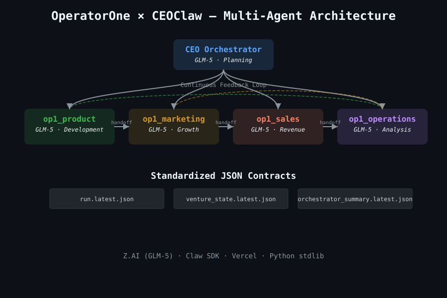
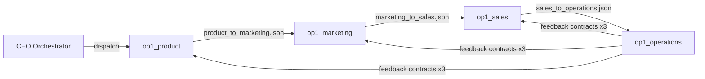
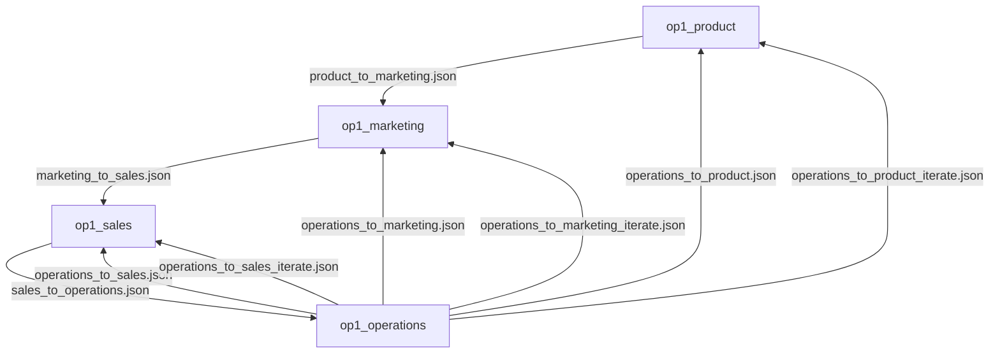
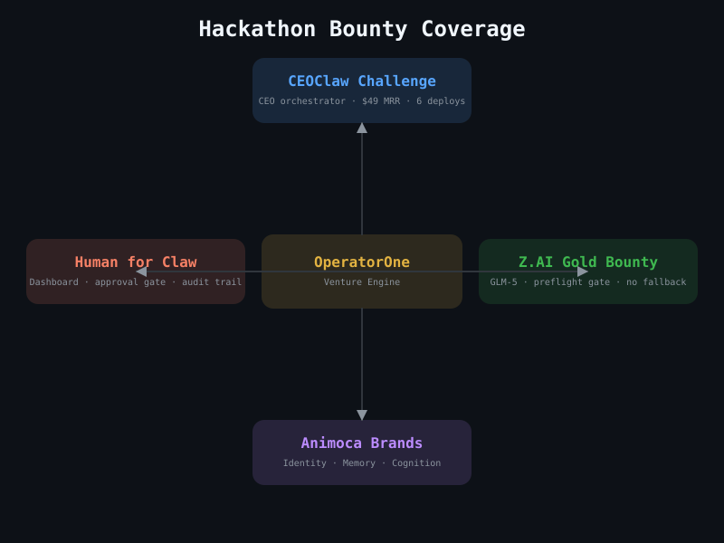

<div align="center">

[](#operatorone--ceoclaw) &nbsp;
[](#operatorone--ceoclaw-chinese)

</div>

---

<a name="operatorone--ceoclaw"></a>

# OperatorOne × CEOClaw

> **UK AI Agent Hackathon EP4 × OpenClaw — CEOClaw Challenge submission**
> Team: Dennis & Bennett · Branch: `dennis/automation-framework`
> Repo: https://github.com/Daihaolin201/OperatorOne

<div align="center">

[](https://github.com/Daihaolin201/OperatorOne)
[](LICENSE)
[](https://z.ai)
[](#real-results)
[](#agent-topology)
[](#handoff-contracts)

</div>

**CEOClaw** is OperatorOne's multi-agent CEO orchestrator. It autonomously coordinates four specialist agents — Product, Marketing, Sales, and Operations — to run an internet business from initial idea to first customers.

---

## Real Results

This is not a demo. These numbers reflect actual pipeline execution.

| Metric | Value |
|---|---|
| Current MRR | **$49** (target: $100) |
| Prospects contacted | **13** |
| Replies received | **6** |
| Customers converted | **1** |
| Products deployed | **6 live Vercel URLs** |
| Campaigns prepared | **9** (3 launch_ready, 5 watchlist, 1 approved) |
| Content assets | **12** (3 approved, 9 review_ready) |
| Agent handoffs | **9 JSON contracts** |

MRR Progress (49 / 100):
```text
$0   [$49                    $100]
     [██████████░░░░░░░░░░]
      49%        -->        100%
```

---

## Architecture

<div align="center">

</div>

---

## CEOClaw Quick Start

Judges, use these commands to run the orchestrator in simulation mode.

```bash
git clone https://github.com/Daihaolin201/OperatorOne
cd OperatorOne
git checkout dennis/automation-framework
python3 workspaces/op1_ceo/scripts/run_ceo_multi_agent_orchestrator_v1.py --dry-run
cat workspaces/op1_ceo/research/ceo_orchestration/venture_state.latest.json
```

| Artifact | Description |
|---|---|
| `run.latest.json` | Full 4-agent execution log with realistic simulation replies |
| `venture_state.latest.json` | Venture KPI snapshot (MRR, prospects, campaigns, deployed URLs) |
| `orchestrator_summary.latest.json` | Operator-facing summary |

---

## How It Works

*   **Stage-gated multi-agent loop**: Each specialist (Product, Marketing, Sales, Operations) hands off a JSON contract to the next stage rather than making isolated agent calls.
*   **Approval-gated external actions**: `approval.json` controls whether external actions like emails or deployments are permitted. This ensures the system is fully auditable.
*   **Real business execution**: The pipeline has been run end-to-end, resulting in 6 products deployed to Vercel, 13 prospects contacted, and $49 MRR earned.
*   **Handoff contract schema**: 9 typed JSON contracts include `contract_version`, `generated_at`, and `generated_by` metadata for full traceability.
*   **Iteration loop**: Operations feedback (10 items, P2/P3 prioritized) feeds back to Product, Marketing, and Sales for the next cycle.

### Agent Pipeline Flow



---

## Live Products

| URL | Product |
|---|---|
| https://webproductmodularinvoice.vercel.app | Invoice follow-up tool |
| https://webproductmodularchargeback.vercel.app | Chargeback response ops |
| https://webproductmodularreporting.vercel.app | Client reporting module |
| https://webproductlandingstage3validation.vercel.app | Validation landing page |
| https://webproductlandingstage3opp002.vercel.app | opp_002 landing page |
| https://webproductlandingstage3opp003.vercel.app | opp_003 landing page |

---

## Handoff Contracts

The repository maintains state through 9 distinct handoff contracts, all at `contract_version: 1.0.0`. Each includes `contract_version`, `generated_at`, and `generated_by` metadata for full traceability.

```
handoffs/
├── product_to_marketing.json              Product -> Marketing
├── marketing_to_sales.json                Marketing -> Sales
├── sales_to_operations.json               Sales -> Operations
├── operations_to_product.json             Operations -> Product (feedback)
├── operations_to_marketing.json           Operations -> Marketing (feedback)
├── operations_to_sales.json               Operations -> Sales (feedback)
├── operations_to_product_iterate.json     Operations -> Product (iterate)
├── operations_to_marketing_iterate.json   Operations -> Marketing (iterate)
└── operations_to_sales_iterate.json       Operations -> Sales (iterate)
```

### Handoff Contract Map



---

## Z.AI and GLM-5 Integration

OperatorOne targets **GLM-5** as its primary intelligence engine. Released in February 2026, GLM-5 is the flagship model from Z.AI (Zhipu AI).

### Why GLM-5 for OperatorOne

*   **744B MoE Architecture**: Massive capacity with 40B active parameters for efficient inference.
*   **202K Context Window**: Enables analysis of extensive business logs and market research.
*   **"Slime" Async RL**: A novel framework that significantly improves long-horizon agent behavior.
*   **Superior Coding**: Top open-weights model for engineering tasks.
*   **High Cognition**: Substantial improvement in complex reasoning over previous generations.

### GLM-5 Benchmarks

| Benchmark | Score |
|---|---|
| SWE-bench Verified | 77.8% |
| Terminal-Bench-2.0 | 61.1% |
| BrowseComp | 75.9% |
| HLE w/ Tools | 50.4% |

### Per-Agent Model Routing

| Agent | Task Type | Model | Why GLM-5 |
|---|---|---|---|
| op1_product | Code gen, Vercel deploy | glm-5 | SWE-bench 77.8% — top open-weights coding model |
| op1_marketing | Content, SEO copy | glm-5 | Ultra-low hallucination, 202K context window |
| op1_sales | Outreach, dialogue | glm-5 | Native agent mode + "Slime" RL for planning |
| op1_operations | KPI analysis, JSON | glm-5 | Structured output, BrowseComp 75.9% |
| CEO Orchestrator | Planning, routing | glm-5 | Terminal-Bench +28.3% improvement |

### API Configuration

The preflight gate (`dashboard/zai_preflight.py`) enforces Z.AI API compliance.

```bash
# Configuration
export ZAI_API_BASE="https://api.z.ai/api/paas/v4"
export ZAI_MODEL="glm-5"
export ZAI_API_KEY="your-key-here"

# Verify preflight
python3 -m pytest dashboard/tests/ -q
```

### Preflight Explanation
The system enforces a hard gate via `dashboard/zai_preflight.py`. If the Z.AI environment is misconfigured, the system raises a `ZAIPreflightError` and halts. There is no silent fallback, ensuring strict compliance with the Z.AI Gold Bounty requirements.

---

## Hackathon Bounties

### CEOClaw Challenge (£1,000)
*   **Evidence**: The CEO orchestrator successfully runs a 4-agent loop end-to-end. Real results include $49 MRR, 13 prospects contacted, and 6 Vercel products deployed.
*   **Verification**: `python3 workspaces/op1_ceo/scripts/run_ceo_multi_agent_orchestrator_v1.py --dry-run`

### Z.AI Gold Bounty
*   **Evidence**: GLM-5 is the featured model for all 5 roles. The preflight gate enforces correct `base_url` and model configuration without silent fallback.
*   **Verification**: `python3 -m pytest dashboard/tests/ -q`

### Animoca Brands
*   **Identity**: The CEO has a persistent persona and execution logic defined in `workspaces/op1_ceo/AGENTS.md`.
*   **Memory**: 9 inter-agent JSON contracts persist state and learnings across agent boundaries.
*   **Cognition**: The Operations iteration loop feeds learned feedback back into the system for continuous improvement.

### Human for Claw
*   **Dashboard**: A dedicated stage view at `http://127.0.0.1:8765` provides human-readable status and artifact tracking.
*   **Approval Gate**: `approval.json` gates every external action, keeping the human operator in control of deployments and communications.

---

## Bounty Coverage

<div align="center">

</div>

---

## Agent Topology

| Workspace | Role | In manifest | Primary responsibility |
|---|---|---|---|
| `workspaces/op1_product` | Product | yes | Idea discovery, web product build/deploy |
| `workspaces/op1_marketing` | Marketing | yes | SEO, content, and campaign pipeline |
| `workspaces/op1_sales` | Sales | yes | Prospecting, outreach, and conversion |
| `workspaces/op1_operations` | Operations | yes | KPI tracking and feedback loop |
| `workspaces/op1_manager` | Manager | no | Cross-agent orchestration and audits |

---

## Repository Layout

*   `openclaw/`: profile sync and safety scripts.
*   `workspaces/`: isolated agent workspaces and stage artifacts.
*   `handoffs/`: inter-agent JSON contracts (9 contracts).
*   `dashboard/`: local monitor and venture studio web app.
*   `official-site/`: OperatorOne official intro page.
*   `shared/`: shared prompts, skills, and templates.
*   `docs/`: architecture, collaboration protocol, and runbook.
*   `apps/`: Next.js portal and product apps (monorepo).
*   `packages/`: shared @op1/* packages.

---

## Dashboard

Run the local dashboard to monitor the venture studio.

```bash
python3 dashboard/server.py --host 127.0.0.1 --port 8765
```

---

## Developer Reference

### Service Map
| Service | URL | Health Check |
|---|---|---|
| Dashboard | `http://localhost:8765` | `/api/health` |
| Platform Portal | `http://localhost:3000` | `/healthz` |
| Product UI | `http://localhost:3001` | `/healthz` |

### Scripts List
*   `python3 scripts/validate_handoffs.py --repo-root .`
*   `python3 scripts/upgrade_handoffs.py --repo-root .`
*   `python3 scripts/change_hygiene_guard.py --staged`
*   `python3 scripts/reset_generated_artifacts.py --apply`

---

## Demo Video

Detailed walkthrough can be found at `docs/demo_video_script.md`.

---

<a name="operatorone--ceoclaw-chinese"></a>

# OperatorOne × CEOClaw (中文版)

> **UK AI Agent Hackathon EP4 × OpenClaw — CEOClaw Challenge 提交项目**
> 团队：Dennis & Bennett · 分支：`dennis/automation-framework`
> 仓库：https://github.com/Daihaolin201/OperatorOne

<div align="center">

[](https://github.com/Daihaolin201/OperatorOne)
[](LICENSE)
[](https://z.ai)
[](#real-results-chinese)
[](#agent-topology-chinese)
[](#handoff-contracts-chinese)

</div>

**CEOClaw** 是 OperatorOne 的多智能体 CEO 编排器。它能够自动协调四个专业智能体（Product, Marketing, Sales, Operations），实现从最初创意到获取首批客户的全流程业务运营。

---

<a name="real-results-chinese"></a>

## 实际成果

本项目并非演示原型，以下数据源自真实的流水线执行。

| 指标 | 数值 |
|---|---|
| 当前 MRR | **$49** (目标: $100) |
| 已联系潜在客户 | **13** |
| 收到回复 | **6** |
| 已转化客户 | **1** |
| 已部署产品 | **6 个 Vercel 实时链接** |
| 已准备活动 | **9** (3 个就绪, 5 个观察名单, 1 个批准) |
| 内容资产 | **12** (3 个批准, 9 个待审核) |
| 智能体交付物 | **9 个 JSON 合约** |

MRR 进度（49 / 100）：
```text
$0   [$49                    $100]
     [██████████░░░░░░░░░░]
      49%        -->        100%
```

---

## 系统架构

<div align="center">

</div>

---

## CEOClaw 快速开始

评委可以通过以下命令在模拟模式下运行编排器。

```bash
git clone https://github.com/Daihaolin201/OperatorOne
cd OperatorOne
git checkout dennis/automation-framework
python3 workspaces/op1_ceo/scripts/run_ceo_multi_agent_orchestrator_v1.py --dry-run
cat workspaces/op1_ceo/research/ceo_orchestration/venture_state.latest.json
```

| 产物 | 描述 |
|---|---|
| `run.latest.json` | 包含真实模拟回复的 4 智能体执行完整日志 |
| `venture_state.latest.json` | 项目 KPI 快照（包含 MRR、潜在客户、活动、部署链接） |
| `orchestrator_summary.latest.json` | 面向操作员的执行摘要 |

---

## 工作原理

*   **阶段门控多智能体循环**：各专业智能体（Product, Marketing, Sales, Operations）通过 JSON 合约向下一阶段交付成果，而非孤立调用。
*   **审批门控外部操作**：通过 `approval.json` 控制邮件发送或部署等外部操作权限，确保系统完全可审计。
*   **真实的业务执行**：流水线已完成端到端运行，成功部署 6 个 Vercel 产品，联系 13 位潜在客户，并获得 $49 MRR。
*   **交付合约架构**：9 个类型化的 JSON 合约包含版本、生成时间和生成者等元数据，确保全流程可追溯。
*   **迭代循环**：Operations 的反馈（10 个事项，已按优先级排序）会反馈给其他智能体，开启下一轮迭代。

### 智能体工作流


---

## 线上产品

| 链接 | 产品 |
|---|---|
| https://webproductmodularinvoice.vercel.app | 发票跟进工具 |
| https://webproductmodularchargeback.vercel.app | 拒付申诉操作工具 |
| https://webproductmodularreporting.vercel.app | 客户报告模块 |
| https://webproductlandingstage3validation.vercel.app | 验证落地页 |
| https://webproductlandingstage3opp002.vercel.app | opp_002 落地页 |
| https://webproductlandingstage3opp003.vercel.app | opp_003 落地页 |

---

<a name="handoff-contracts-chinese"></a>

## 交付合约

仓库通过 9 个独立的交付合约维护状态。

### 交付合约映射图


---

## Z.AI 与 GLM-5 集成

OperatorOne 采用 **GLM-5** 作为核心智能引擎。GLM-5 由 Z.AI（智谱 AI）于 2026 年 2 月发布，是其最新的旗舰级模型。

### 为什么选择 GLM-5

*   **744B MoE 架构**：超大规模参数量，40B 激活参数确保高效推理。
*   **202K 上下文窗口**：支持分析超长业务日志和市场调研数据。
*   **"Slime" 异步强化学习**：全新的 RL 框架显著提升了智能体的长周期行为表现。
*   **卓越的代码能力**：在工程任务中表现优异的开源模型。
*   **高水平认知**：较上一代在复杂推理方面有显著提升。

### GLM-5 跑分数据

| 测试集 | 分数 |
|---|---|
| SWE-bench Verified | 77.8% |
| Terminal-Bench-2.0 | 61.1% |
| BrowseComp | 75.9% |
| HLE w/ Tools | 50.4% |

### 智能体模型路由

| 智能体 | 任务类型 | 模型 | 为什么选择 GLM-5 |
|---|---|---|---|
| op1_product | 代码生成、部署 | glm-5 | SWE-bench 77.8% — 开源模型第一 |
| op1_marketing | 内容创作、SEO | glm-5 | 极低幻觉率，202K 上下文支持 |
| op1_sales | 外联、对话 | glm-5 | 原生智能体模式 + "Slime" 规划 |
| op1_operations | KPI 分析、JSON | glm-5 | 结构化输出，BrowseComp 75.9% |
| CEO Orchestrator | 规划、路由 | glm-5 | Terminal-Bench 提升 28.3% |

### API 配置

系统通过 `dashboard/zai_preflight.py` 强制执行 Z.AI API 预检查。

```bash
# 配置
export ZAI_API_BASE="https://api.z.ai/api/paas/v4"
export ZAI_MODEL="glm-5"
export ZAI_API_KEY="your-key-here"

# 运行测试验证
python3 -m pytest dashboard/tests/ -q
```

### 预检查说明
系统通过 `dashboard/zai_preflight.py` 强制执行硬门控。如果环境配置不正确，系统将抛出 `ZAIPreflightError` 并停止运行。系统不会静默回退，确保严格符合 Z.AI 奖项要求。

---

## 黑客马拉松奖项

### CEOClaw Challenge (£1,000)
*   **证据**：CEO 编排器端到端运行 4 智能体循环；实现 $49 MRR 真实收入；部署 6 个 Vercel 产品。
*   **验证方式**：`python3 workspaces/op1_ceo/scripts/run_ceo_multi_agent_orchestrator_v1.py --dry-run`

### Z.AI Gold Bounty
*   **证据**：GLM-5 充当全部 5 个角色的核心模型。预检查门控强制执行正确的配置，且无静默回退。
*   **验证方式**：`python3 -m pytest dashboard/tests/ -q`

### Animoca Brands
*   **证据**：CEO 拥有在 `workspaces/op1_ceo/AGENTS.md` 中定义的持久人格与逻辑。
*   **记忆**：9 个 JSON 合约在智能体边界间持久化状态与学习成果。
*   **认知**：Operations 迭代循环将反馈重新输入系统，实现持续改进。

### Human for Claw
*   **证据**：位于 `http://127.0.0.1:8765` 的专用视图提供直观的状态与产物追踪。
*   **审批门控**：`approval.json` 门控所有外部操作，确保人类操作员保持最终控制权。

---

## 奖项覆盖矩阵

<div align="center">

</div>

---

<a name="agent-topology-chinese"></a>

## 智能体拓扑

| 工作区 | 角色 | 是否在 manifest 中 | 主要职责 |
|---|---|---|---|
| `workspaces/op1_product` | Product | 是 | 创意发现、Web 产品构建与部署 |
| `workspaces/op1_marketing` | Marketing | 是 | SEO、内容创作与营销流水线 |
| `workspaces/op1_sales` | Sales | 是 | 客户开发、外联与转化 |
| `workspaces/op1_operations` | Operations | 是 | KPI 追踪与反馈循环 |
| `workspaces/op1_manager` | Manager | 否 | 跨智能体编排与审计 |

---

## 仓库布局

*   `openclaw/`：配置文件同步与安全脚本。
*   `workspaces/`：隔离的智能体工作区及产物。
*   `handoffs/`：智能体间的 JSON 交付合约（共 9 个）。
*   `dashboard/`：本地监控器及创业工作室 Web 应用。
*   `official-site/`：OperatorOne 官方介绍页。
*   `shared/`：共享的提示词、技能及模板。
*   `docs/`：架构设计、协议及指南。
*   `apps/`：Next.js 门户及产品应用。
*   `packages/`：共享的 @op1/* 软件包。

---

## 控制面板

运行本地控制面板以监控项目状态。

```bash
python3 dashboard/server.py --host 127.0.0.1 --port 8765
```

---

## 开发者参考

### 服务映射表
| 服务 | 链接 | 健康检查 |
|---|---|---|
| Dashboard | `http://localhost:8765` | `/api/health` |
| Platform Portal | `http://localhost:3000` | `/healthz` |
| Product UI | `http://localhost:3001` | `/healthz` |

### 脚本辅助工具
*   `python3 scripts/validate_handoffs.py --repo-root .`
*   `python3 scripts/upgrade_handoffs.py --repo-root .`
*   `python3 scripts/change_hygiene_guard.py --staged`
*   `python3 scripts/reset_generated_artifacts.py --apply`

---

## 演示视频

详细的项目演示可见 `docs/demo_video_script.md`。
