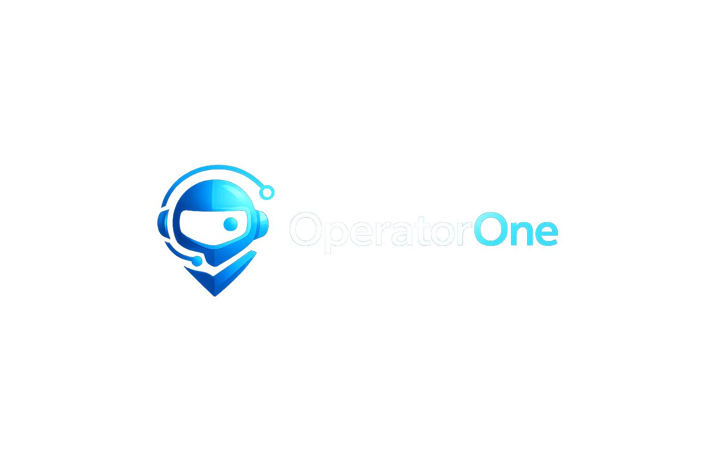
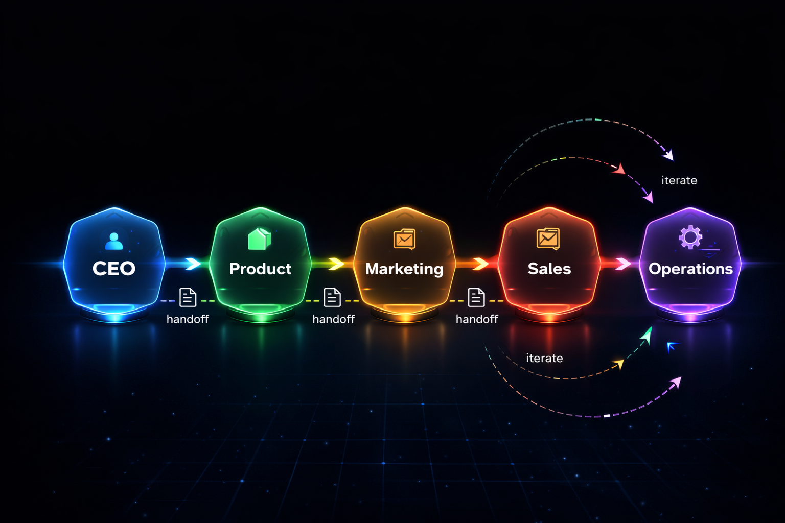
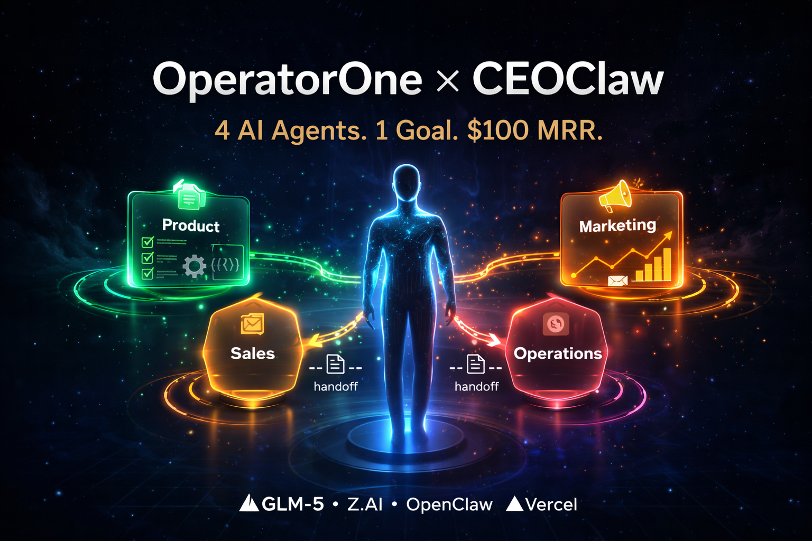

<div align="center">



<br/>

[](#english) &nbsp;
[](#chinese)

</div>

---

<a name="english"></a>

<div align="center">


<br/><br/>

[](https://github.com/Daihaolin201/OperatorOne)
[](LICENSE)
[](https://z.ai)
[](#real-results)
[](#agent-topology)
[](#handoff-contracts)

</div>

<br/>

**CEOClaw** is OperatorOne's multi-agent CEO orchestrator. It autonomously coordinates four specialist agents — Product, Marketing, Sales, and Operations — to run an internet business from initial idea to first paying customers, powered by GLM-5 from Z.AI.

> **UK AI Agent Hackathon EP4 × OpenClaw — CEOClaw Challenge**
> Team: Dennis & Bennett · Branch: `dennis/automation-framework`

---

## Quick Start

```bash
git clone https://github.com/Daihaolin201/OperatorOne
cd OperatorOne
git checkout dennis/automation-framework

# Run the full 4-agent pipeline in simulation mode
python3 workspaces/op1_ceo/scripts/run_ceo_multi_agent_orchestrator_v1.py --dry-run

# Inspect the venture state
cat workspaces/op1_ceo/research/ceo_orchestration/venture_state.latest.json
```

| Artifact | Description |
|---|---|
| `run.latest.json` | Full 4-agent execution log with simulation replies |
| `venture_state.latest.json` | Live KPI snapshot — MRR, prospects, deployed URLs |
| `orchestrator_summary.latest.json` | Operator-facing summary |

---

<a name="real-results"></a>

## Real Results

This is not a mock. Every number below came from a live pipeline run.

<div align="center">

| Metric | Value |
|:---|:---|
| Current MRR | **$49** — target $100 |
| Prospects contacted | **13** |
| Replies received | **6** |
| Customers converted | **1** |
| Live Vercel products | **6** |
| Campaigns prepared | **9** (3 launch-ready, 5 watchlist, 1 approved) |
| Content assets | **12** (3 approved, 9 review-ready) |
| Agent handoff contracts | **9 JSON files** |

</div>

**MRR Progress**

```
$0 ──────────── $49 ────────────────── $100
    ████████████░░░░░░░░░░░░░░░░░░░░░░  49%
```

---

## How It Works

<div align="center">

</div>

<br/>

The pipeline runs in **stage-gated cycles**. Each agent hands off a typed JSON contract to the next stage. Operations feeds results back, and the orchestrator loops until the MRR target is reached or `--max-cycles` is exhausted.

| Stage | Agent | Responsibility | Handoff Out |
|---|---|---|---|
| 1 | `op1_product` | Idea selection, Vercel deploy | `product_to_marketing.json` |
| 2 | `op1_marketing` | GTM campaigns, content assets | `marketing_to_sales.json` |
| 3 | `op1_sales` | Outreach, qualification, close | `sales_to_operations.json` |
| 4 | `op1_operations` | KPI triage, feedback loop | `operations_to_*.json` x6 |

**Key design properties:**

- **Approval gate** — `approval.json` must be set before any external action (email, deploy). No silent execution.
- **Multi-cycle loop** — orchestrator re-runs until `mrr >= target_mrr` or `max_cycles` (default 3) reached.
- **Full auditability** — every agent turn is logged to `run.latest.json` with timestamps, exit codes, and reply text.
- **Typed contracts** — all 9 handoff files carry `contract_version`, `generated_at`, and `generated_by` fields.

---

## Handoff Contracts

<a name="handoff-contracts"></a>

```
handoffs/
├── product_to_marketing.json              Product → Marketing
├── marketing_to_sales.json                Marketing → Sales
├── sales_to_operations.json               Sales → Operations
├── operations_to_product.json             Operations → Product  (feedback)
├── operations_to_marketing.json           Operations → Marketing (feedback)
├── operations_to_sales.json               Operations → Sales    (feedback)
├── operations_to_product_iterate.json     Operations → Product  (iterate)
├── operations_to_marketing_iterate.json   Operations → Marketing (iterate)
└── operations_to_sales_iterate.json       Operations → Sales    (iterate)
```

---

## Live Products

Six products are deployed and publicly accessible on Vercel:

| Product | URL |
|---|---|
| Invoice follow-up tool | https://webproductmodularinvoice.vercel.app |
| Chargeback response ops | https://webproductmodularchargeback.vercel.app |
| Client reporting module | https://webproductmodularreporting.vercel.app |
| Validation landing page | https://webproductlandingstage3validation.vercel.app |
| opp_002 landing page | https://webproductlandingstage3opp002.vercel.app |
| opp_003 landing page | https://webproductlandingstage3opp003.vercel.app |

---

## Z.AI & GLM-5

Every agent in OperatorOne runs on **GLM-5**, the flagship model from Z.AI (Zhipu AI), released February 2026.

| Capability | Spec |
|---|---|
| Architecture | 744B MoE, 40B active parameters |
| Context window | 202K tokens |
| Training | "Slime" Async RL for long-horizon agents |
| SWE-bench Verified | **77.8%** |
| Terminal-Bench-2.0 | **61.1%** |
| BrowseComp | **75.9%** |
| HLE w/ Tools | **50.4%** |

**Per-agent model routing:**

| Agent | Task | Why GLM-5 |
|---|---|---|
| `op1_product` | Code gen, Vercel deploy | SWE-bench 77.8% — top open-weights coding |
| `op1_marketing` | Content, SEO copy | 202K context, ultra-low hallucination |
| `op1_sales` | Outreach, dialogue | Native agent mode + Slime RL planning |
| `op1_operations` | KPI analysis, JSON | Structured output, BrowseComp 75.9% |
| CEO Orchestrator | Planning, routing | Terminal-Bench +28.3% improvement |

**API configuration:**

```bash
export ZAI_API_BASE="https://api.z.ai/api/paas/v4"
export ZAI_MODEL="glm-5"
export ZAI_API_KEY="your-key-here"

# Verify compliance
python3 -m pytest dashboard/tests/ -q
```

The preflight gate (`dashboard/zai_preflight.py`) raises `ZAIPreflightError` and halts if configuration is wrong. No silent fallback — strict Z.AI Gold Bounty compliance.

---

## Hackathon Bounties

| Bounty | Evidence | Verification |
|---|---|---|
| **CEOClaw Challenge (£1,000)** | 4-agent loop end-to-end, $49 real MRR, 6 Vercel deploys | `python3 ...run_ceo_multi_agent_orchestrator_v1.py --dry-run` |
| **Z.AI Gold Bounty** | GLM-5 for all 5 roles, hard preflight gate, no fallback | `python3 -m pytest dashboard/tests/ -q` |
| **Animoca Brands** | CEO persona in `AGENTS.md`, 9 JSON memory contracts, iteration loop | Browse `handoffs/` and `workspaces/op1_ceo/` |
| **Human for Claw** | Dashboard at `:8765`, approval.json gate, full audit log | `python3 dashboard/server.py --port 8765` |

---

<a name="agent-topology"></a>

## Agent Topology

| Workspace | Role | In Manifest | Responsibility |
|---|---|---|---|
| `workspaces/op1_product` | Product | yes | Idea discovery, web product build and deploy |
| `workspaces/op1_marketing` | Marketing | yes | SEO, content, campaign pipeline |
| `workspaces/op1_sales` | Sales | yes | Prospecting, outreach, conversion |
| `workspaces/op1_operations` | Operations | yes | KPI tracking and feedback loop |
| `workspaces/op1_manager` | Manager | no | Cross-agent orchestration and audits |

---

## Repository Layout

```
OperatorOne/
├── workspaces/          Agent workspaces and stage artifacts
├── handoffs/            9 inter-agent JSON contracts
├── dashboard/           Local monitor and venture studio web app
├── apps/                Next.js portal and product apps
├── packages/            Shared @op1/* packages
├── openclaw/            Profile sync and safety scripts
├── official-site/       OperatorOne intro page
├── shared/              Shared prompts, skills, templates
└── docs/                Architecture, runbook, collaboration protocol
```

---

## Dashboard

```bash
python3 dashboard/server.py --host 127.0.0.1 --port 8765
```

| Service | URL | Health |
|---|---|---|
| Dashboard | `http://localhost:8765` | `/api/health` |
| Platform Portal | `http://localhost:3000` | `/healthz` |
| Product UI | `http://localhost:3001` | `/healthz` |

---

## Demo Video

<div align="center">

</div>

<br/>

Full walkthrough: [`docs/demo_video_script.md`](docs/demo_video_script.md)

---

<a name="chinese"></a>

<div align="center">


<br/><br/>

[](https://github.com/Daihaolin201/OperatorOne)
[](LICENSE)
[](https://z.ai)
[](#real-results-cn)
[](#agent-topology-cn)
[](#handoff-contracts-cn)

</div>

<br/>

**CEOClaw** 是 OperatorOne 的多智能体 CEO 编排器，由 Z.AI 的 GLM-5 驱动。它能自动协调 Product、Marketing、Sales、Operations 四个专业智能体，完成从创意到第一批付费客户的全流程业务运营。

> **UK AI Agent Hackathon EP4 × OpenClaw — CEOClaw Challenge**
> 团队：Dennis & Bennett · 分支：`dennis/automation-framework`

---

## 快速开始

```bash
git clone https://github.com/Daihaolin201/OperatorOne
cd OperatorOne
git checkout dennis/automation-framework

# 在模拟模式下运行完整的 4 智能体流水线
python3 workspaces/op1_ceo/scripts/run_ceo_multi_agent_orchestrator_v1.py --dry-run

# 查看项目状态
cat workspaces/op1_ceo/research/ceo_orchestration/venture_state.latest.json
```

| 产物 | 描述 |
|---|---|
| `run.latest.json` | 完整的 4 智能体执行日志（含模拟回复） |
| `venture_state.latest.json` | 实时 KPI 快照——MRR、潜在客户、部署链接 |
| `orchestrator_summary.latest.json` | 面向操作员的执行摘要 |

---

<a name="real-results-cn"></a>

## 实际成果

以下数据全部来自真实的流水线执行，非模拟数据。

<div align="center">

| 指标 | 数值 |
|:---|:---|
| 当前 MRR | **$49**——目标 $100 |
| 已联系潜在客户 | **13** |
| 收到回复 | **6** |
| 已转化付费客户 | **1** |
| 已部署线上产品 | **6 个 Vercel 链接** |
| 已准备活动 | **9 个**（3 个就绪，5 个观察名单，1 个已批准） |
| 内容资产 | **12 个**（3 个已批准，9 个待审核） |
| 智能体交付合约 | **9 个 JSON 文件** |

</div>

**MRR 进度**

```
$0 ──────────── $49 ────────────────── $100
    ████████████░░░░░░░░░░░░░░░░░░░░░░  49%
```

---

## 工作原理

<div align="center">

</div>

<br/>

流水线以**阶段门控循环**方式运行。每个智能体将类型化的 JSON 合约交付给下一阶段。Operations 将结果反馈回来，编排器持续循环，直到 MRR 达到目标或耗尽 `--max-cycles`（默认 3 次）。

| 阶段 | 智能体 | 职责 | 交付产物 |
|---|---|---|---|
| 1 | `op1_product` | 创意筛选、Vercel 部署 | `product_to_marketing.json` |
| 2 | `op1_marketing` | GTM 活动、内容资产 | `marketing_to_sales.json` |
| 3 | `op1_sales` | 外联、筛选、签约 | `sales_to_operations.json` |
| 4 | `op1_operations` | KPI 分析、反馈循环 | `operations_to_*.json` x6 |

**核心设计特性：**

- **审批门控** — 外部操作（发邮件、部署）前必须设置 `approval.json`，不允许静默执行。
- **多轮循环** — 编排器持续重跑，直到 `mrr >= target_mrr` 或达到最大轮次。
- **完整可审计** — 每次智能体执行均记录至 `run.latest.json`，含时间戳、退出码和回复文本。
- **类型化合约** — 所有 9 个交付文件均携带 `contract_version`、`generated_at`、`generated_by` 字段。

---

<a name="handoff-contracts-cn"></a>

## 交付合约

```
handoffs/
├── product_to_marketing.json              Product → Marketing
├── marketing_to_sales.json                Marketing → Sales
├── sales_to_operations.json               Sales → Operations
├── operations_to_product.json             Operations → Product  (反馈)
├── operations_to_marketing.json           Operations → Marketing (反馈)
├── operations_to_sales.json               Operations → Sales    (反馈)
├── operations_to_product_iterate.json     Operations → Product  (迭代)
├── operations_to_marketing_iterate.json   Operations → Marketing (迭代)
└── operations_to_sales_iterate.json       Operations → Sales    (迭代)
```

---

## 线上产品

六个产品已部署并在 Vercel 上公开访问：

| 产品 | 链接 |
|---|---|
| 发票跟进工具 | https://webproductmodularinvoice.vercel.app |
| 拒付申诉操作工具 | https://webproductmodularchargeback.vercel.app |
| 客户报告模块 | https://webproductmodularreporting.vercel.app |
| 验证落地页 | https://webproductlandingstage3validation.vercel.app |
| opp_002 落地页 | https://webproductlandingstage3opp002.vercel.app |
| opp_003 落地页 | https://webproductlandingstage3opp003.vercel.app |

---

## Z.AI 与 GLM-5

OperatorOne 全部智能体均运行在 **GLM-5** 上，GLM-5 是 Z.AI（智谱 AI）于 2026 年 2 月发布的旗舰模型。

| 能力 | 规格 |
|---|---|
| 架构 | 744B MoE，40B 激活参数 |
| 上下文窗口 | 202K tokens |
| 训练方式 | "Slime" 异步 RL，专为长周期智能体优化 |
| SWE-bench Verified | **77.8%** |
| Terminal-Bench-2.0 | **61.1%** |
| BrowseComp | **75.9%** |
| HLE w/ Tools | **50.4%** |

**API 配置：**

```bash
export ZAI_API_BASE="https://api.z.ai/api/paas/v4"
export ZAI_MODEL="glm-5"
export ZAI_API_KEY="your-key-here"

python3 -m pytest dashboard/tests/ -q
```

预检查门控（`dashboard/zai_preflight.py`）在配置错误时抛出 `ZAIPreflightError` 并中止运行，不存在静默回退。

---

## 黑客马拉松奖项

| 奖项 | 证据 | 验证方式 |
|---|---|---|
| **CEOClaw Challenge (£1,000)** | 4 智能体端到端运行，$49 真实 MRR，6 个 Vercel 部署 | `python3 ...run_ceo_multi_agent_orchestrator_v1.py --dry-run` |
| **Z.AI Gold Bounty** | GLM-5 担任全部 5 个角色，硬预检查门控，无静默回退 | `python3 -m pytest dashboard/tests/ -q` |
| **Animoca Brands** | CEO 人格定义于 `AGENTS.md`，9 个 JSON 记忆合约，迭代循环 | 浏览 `handoffs/` 和 `workspaces/op1_ceo/` |
| **Human for Claw** | `:8765` 控制面板，approval.json 门控，完整审计日志 | `python3 dashboard/server.py --port 8765` |

---

<a name="agent-topology-cn"></a>

## 智能体拓扑

| 工作区 | 角色 | 是否在 Manifest | 主要职责 |
|---|---|---|---|
| `workspaces/op1_product` | Product | 是 | 创意发现、Web 产品构建与部署 |
| `workspaces/op1_marketing` | Marketing | 是 | SEO、内容创作与营销流水线 |
| `workspaces/op1_sales` | Sales | 是 | 客户开发、外联与转化 |
| `workspaces/op1_operations` | Operations | 是 | KPI 追踪与反馈循环 |
| `workspaces/op1_manager` | Manager | 否 | 跨智能体编排与审计 |

---

## 仓库布局

```
OperatorOne/
├── workspaces/          智能体工作区及阶段产物
├── handoffs/            9 个智能体间 JSON 合约
├── dashboard/           本地监控器与创业工作室 Web 应用
├── apps/                Next.js 门户及产品应用
├── packages/            共享 @op1/* 软件包
├── openclaw/            配置同步与安全脚本
├── official-site/       OperatorOne 官方介绍页
├── shared/              共享提示词、技能与模板
└── docs/                架构设计、运维手册、协作协议
```

---

## 控制面板

```bash
python3 dashboard/server.py --host 127.0.0.1 --port 8765
```

| 服务 | 链接 | 健康检查 |
|---|---|---|
| Dashboard | `http://localhost:8765` | `/api/health` |
| Platform Portal | `http://localhost:3000` | `/healthz` |
| Product UI | `http://localhost:3001` | `/healthz` |

---

## 演示视频

<div align="center">

</div>

<br/>

完整演示脚本：[`docs/demo_video_script.md`](docs/demo_video_script.md)
